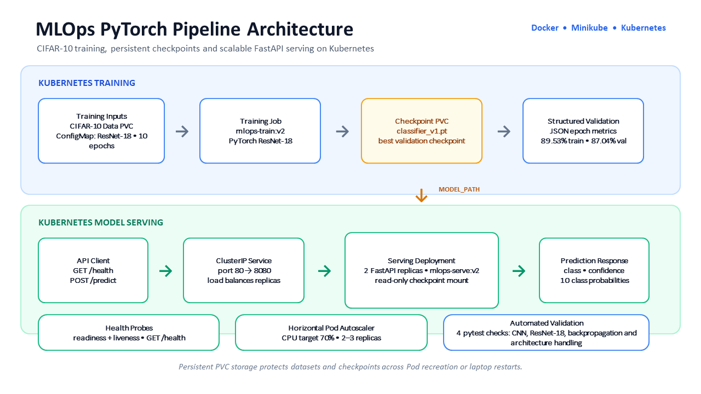
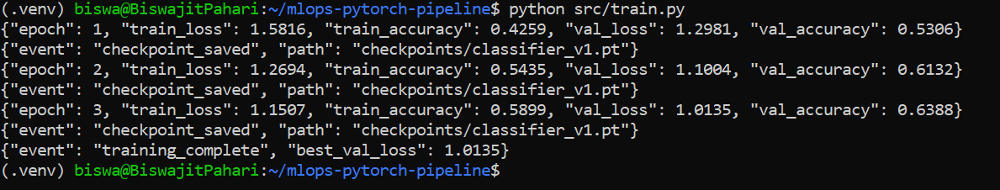
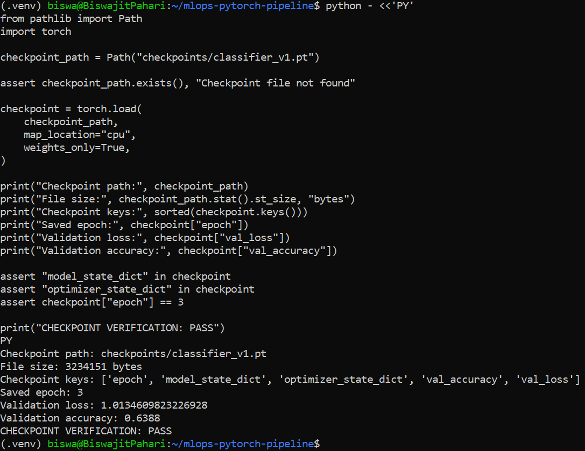
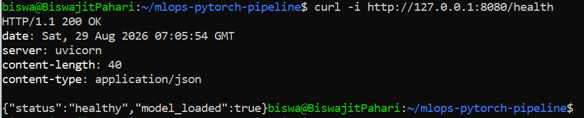
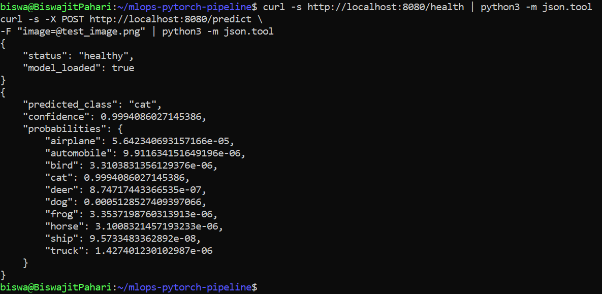
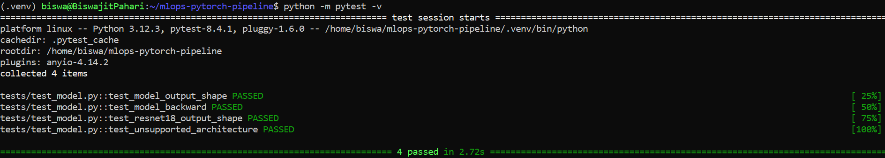

# MLOps PyTorch Pipeline

An end-to-end CIFAR-10 image-classification pipeline using PyTorch, FastAPI, Docker and Kubernetes. It supports local and containerized training, checkpoint persistence, model serving, health checks, rolling updates and autoscaling.

## Architecture



## Local Setup

```bash
git clone https://github.com/da25m557-biswajitpahari/mlops-pytorch-pipeline.git
cd mlops-pytorch-pipeline

python3 -m venv .venv
source .venv/bin/activate

pip install -r requirements/train.txt
pip install -r requirements/serve.txt
pip install -r requirements/dev.txt
```

## Local Model Training

Training parameters are defined in `configs/training_config.yaml`.

```bash
TRAINING_CONFIG=configs/training_config.yaml \
python src/train.py
```

The training loop emits structured JSON metrics, supports early stopping and saves the best checkpoint as `checkpoints/classifier_v1.pt`.

### Structured Training Logs



### Checkpoint Verification



## Local Model Serving

For the locally trained SimpleCNN checkpoint:

```bash
MODEL_PATH=checkpoints/classifier_v1.pt \
MODEL_ARCHITECTURE=simple_cnn \
MODEL_NUM_CLASSES=10 \
python -m uvicorn src.serve:app \
--host 127.0.0.1 --port 8080
```

Health check:

```bash
curl -s http://127.0.0.1:8080/health | python3 -m json.tool
```

Prediction:

```bash
curl -s -X POST http://127.0.0.1:8080/predict \
-F "image=@test_image.png" | python3 -m json.tool
```



## Docker

Build and run training:

```bash
docker build -f docker/Dockerfile.train -t mlops-train:v1 .

docker run --rm \
-v $(pwd)/data:/app/data \
-v $(pwd)/checkpoints:/app/checkpoints \
mlops-train:v1
```

Build and run serving:

```bash
docker build -f docker/Dockerfile.serve -t mlops-serve:v1 .

docker run --rm -p 8080:8080 \
-v $(pwd)/checkpoints:/app/checkpoints \
mlops-serve:v1
```

## Kubernetes with Minikube

Build and load the final images:

```bash
docker build -f docker/Dockerfile.train -t mlops-train:v2 .
docker build -f docker/Dockerfile.serve -t mlops-serve:v2 .

minikube image load mlops-train:v2
minikube image load mlops-serve:v2
```

Deploy training:

```bash
kubectl apply -f k8s/namespace.yaml
kubectl apply -f k8s/pvc.yaml
kubectl apply -f k8s/configmap.yaml
kubectl apply -f k8s/training-job.yaml

kubectl logs -f job/cifar10-training -n ml-training
```

Deploy serving after training completes:

```bash
kubectl apply -f k8s/serving-deployment.yaml
kubectl apply -f k8s/serving-service.yaml
kubectl apply -f k8s/hpa.yaml

kubectl get pods -n ml-training
kubectl port-forward svc/model-serving 8080:80 -n ml-training
```

The Kubernetes ResNet-18 run completed 10 epochs with:

- Training accuracy: **89.53%**
- Validation accuracy: **87.04%**
- Best validation loss: **0.3905**

### Final API Validation

The final ResNet-18 checkpoint was served through Kubernetes and successfully returned class probabilities for the test image.



## Testing

```bash
python -m pytest -v
```

All four automated PyTorch model tests should pass.


